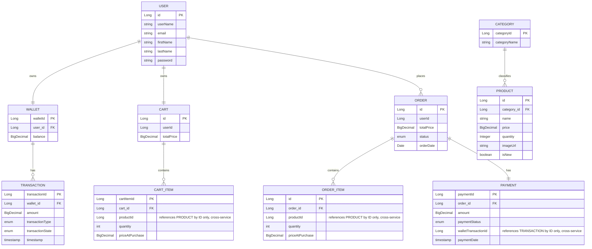

## ERD

Note: `PRODUCT`, `CART_ITEM`/`ORDER_ITEM`, and `TRANSACTION`/`PAYMENT` links across the dashed service boundary (Inventory ↔ Shop ↔ Wallet) are **not real foreign keys** — each service has its own database, so these are ID references resolved at runtime via Feign calls, not DB-enforced relationships. That's also why gap #3 above (no FK guard) exists — there's no database constraint to catch it.
