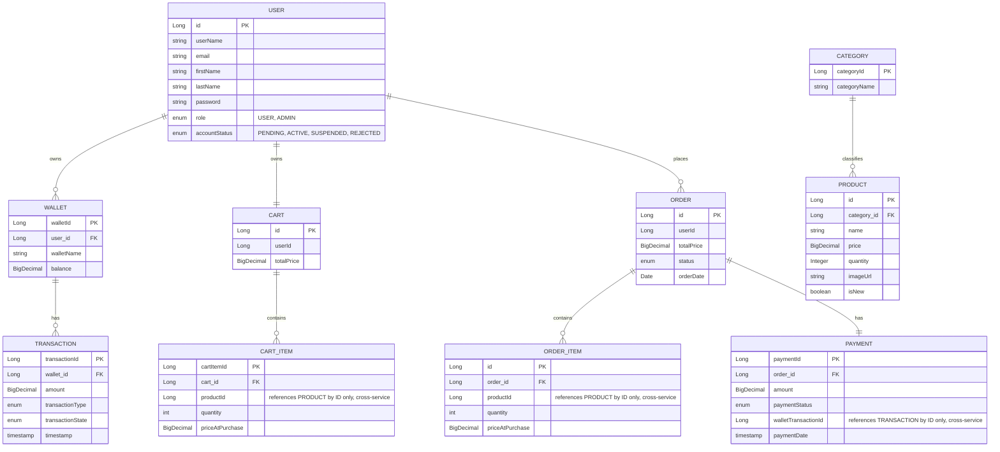

# Postman Testing Guide — E-Commerce Microservices (v2)

Covers: **wallet-service** (`localhost:8080`), **inventory-service** (`localhost:8082`), **shop-service** (`localhost:8081`).

Updated from the original guide to reflect: the `/mine` → no-prefix naming cleanup, body-based deposit/withdraw/transfer with multi-wallet support, admin role/status endpoints, and the inventory category-path-variable fix.

## Before you start
- All 3 services + Eureka (`localhost:8761`) should show all three registered.
- Every protected endpoint needs `Authorization: Bearer <token>`. Get it from step 1.2, save it as a Postman collection variable (`{{token}}`).
- **⚠️ Admin bootstrap gap:** there is currently no way to create the first admin through the API — every admin endpoint requires an existing admin. For now, after your first signup, manually promote that user directly in the wallet-service MySQL DB:
  ```sql
  UPDATE user SET role = 'ADMIN', account_status = 'ACTIVE' WHERE user_name = 'testuser1';
  ```
  Log in again after the update so your token reflects the new role/status. Use this account to activate your other test accounts via the admin endpoints (section 3) instead of hand-editing the DB every time.
- Test roughly in this order — later steps depend on IDs and account states from earlier ones.
- ⚠️ = a known issue, not something you're doing wrong — see the "Known Gaps" section at the end.

---

## 1. Wallet-service — Auth & User

### 1.1 Signup
**POST** `http://localhost:8080/wallet/auth/signup`
```json
{
  "userName": "testuser1",
  "password": "Password123!",
  "firstName": "Test",
  "lastName": "User",
  "email": "testuser1@example.com"
}
```
Expected: 200/201, success message. New users default to role `USER`, status `PENDING`.

### 1.2 Login
**POST** `http://localhost:8080/wallet/auth/login`
```json
{ "userName": "testuser1", "password": "Password123!" }
```
Expected: 200, `{ "token": "..." }`. **Save this token.**

### 1.3 Get current user
**GET** `http://localhost:8080/wallet/users` — Auth required.
Expected: 200, user data, no password field.

### 1.4 Update current user ⚠️
**PATCH** `http://localhost:8080/wallet/users` — Auth required.
```json
{ "firstName": "Updated", "email": "updated@example.com" }
```
Expected: 200, updated fields only — but likely to actually return a **400 validation error** every time. `UserRequestDto.password` is annotated `@NotBlank` but also `@JsonIgnore`, so it's never populated from the request body and fails validation regardless of what you send. Worth confirming live and flagging rather than debugging in the meeting.

### 1.5 Add a wallet
**PATCH** `http://localhost:8080/wallet/users/add-wallet` — Auth required. Requires account status `ACTIVE` (promote via admin endpoints first if still `PENDING`).
```json
{ "walletName": "Savings" }
```
Expected: 200, updated user showing the new wallet. **Save the new `walletId`** — you'll need at least two wallet IDs for deposit/withdraw/transfer testing.

### 1.6 Rename a wallet
**PATCH** `http://localhost:8080/wallet/users/{walletId}` — Auth required.
```json
{ "walletName": "Savings - Renamed" }
```
Expected: 200, updated wallet. Only the wallet's owner should be able to rename it — try this with a different user's `walletId` too, expect a 403/404.

### 1.7 Delete current user
**DELETE** `http://localhost:8080/wallet/users` — Auth required.
Expected: 204 only if all of the user's wallets have 0 balance and no transaction history, otherwise 400. Test on a **throwaway signup**, not your main test account.

---

## 2. Wallet-service — Admin

Requires a token from an `ADMIN` + `ACTIVE` account (see the bootstrap note above).

### 2.1 Change account status
**PATCH** `http://localhost:8080/wallet/admin/users/status` — Auth required (admin).
```json
{ "userId": 2, "accountStatus": "ACTIVE" }
```
Expected: 200, updated user. Valid values: `PENDING`, `ACTIVE`, `SUSPENDED`, `REJECTED`. Try this as a non-admin too — confirm it's actually rejected (403), since enforcement wasn't visible in the controller code itself and may rely on method security elsewhere.

### 2.2 Change user role
**PATCH** `http://localhost:8080/wallet/admin/users/role` — Auth required (admin).
```json
{ "userId": 2, "role": "ADMIN" }
```
Expected: 200, updated user. Same non-admin check as above.

---

## 3. Wallet-service — Wallet operations

Requires account status `ACTIVE`. Uses at least two wallets — do steps 1.5/2.1 first if you haven't already.

### 3.1 Deposit
**POST** `http://localhost:8080/wallet/deposit` — Auth required.
```json
{ "walletId": 1, "amount": 500 }
```
Expected: 200, Transaction (DEPOSIT, COMPLETED) against that specific wallet. Try a `walletId` you don't own → expect 403/404.

### 3.2 Withdraw
**POST** `http://localhost:8080/wallet/withdraw` — Auth required.
```json
{ "walletId": 1, "amount": 100 }
```
Expected: 200. Try `"amount": 999999` too → expect 400 insufficient balance.

### 3.3 Transfer 
**POST** `http://localhost:8080/wallet/transfer` — Auth required.
```json
{ "walletId": 1, "toWalletId": 2, "toUserId": 2, "amount": 50 }
```
Expected: 200, two Transaction rows (PAYMENT, one per wallet).

### 3.4 Transaction history
**GET** `http://localhost:8080/wallet/transactions` — Auth required.
Expected: 200, transactions across **all** of your wallets, newest first.

---

## 4. Inventory-service — Category

### 4.1 Create category
**POST** `http://localhost:8082/categories` — Auth required.
```json
{ "categoryName": "MEN" }
```
Expected: 201, `{ "categoryId": <id>, "categoryName": "MEN" }`. **Save categoryId.**

### 4.2 Get category by ID
**GET** `http://localhost:8082/categories/{categoryId}` — Auth required.

### 4.3 Get all categories
**GET** `http://localhost:8082/categories/all` — Auth required.

### 4.4 Update category
**PATCH** `http://localhost:8082/categories/{categoryId}` — Auth required.
```json
{ "categoryName": "MEN_UPDATED" }
```

### 4.5 Delete category
**DELETE** `http://localhost:8082/categories/{categoryId}` — Auth required.
Expected: 204. Use a spare category, not one your Products reference (⚠️ still no FK guard — see Known Gaps).

---

## 5. Inventory-service — Product

### 5.1 Create product
**POST** `http://localhost:8082/products` — Auth required.
```json
{
  "name": "Running Shoes",
  "price": 79.99,
  "quantity": 50,
  "imageUrl": "https://example.com/shoe.jpg",
  "isNew": true,
  "categoryId": 1
}
```
Expected: 201, includes `categoryId`. **Save productId.**

### 5.2 Get product by ID
**GET** `http://localhost:8082/products/{productId}` — Auth required.

### 5.3 Get products by category
**GET** `http://localhost:8082/products/category/{categoryId}` — Auth required.
This previously failed (path variable was typed as the `Category` entity, never updated when Category moved from enum to entity). The current controller now types this `@PathVariable Long categoryId`, so it should work — worth confirming, but no longer expected to fail.

### 5.4 Update product (partial)
**PATCH** `http://localhost:8082/products/{productId}` — Auth required.
```json
{ "price": 69.99 }
```
Expected: 200, only price changes.

### 5.7 Delete product
**DELETE** `http://localhost:8082/products/{productId}` — Auth required.
Expected: 204. Use a spare product — not one you'll add to cart below.

---

## 6. Shop-service — Cart

### 6.1 Add item to cart
**POST** `http://localhost:8081/api/carts/items` — Auth required.
```json
{ "productId": 1, "quantity": 2 }
```
Expected: 200/201, cart with item + `priceAtPurchase` captured from Inventory, correct `totalPrice`. Also try a nonexistent `productId` → expect 404, not silently accepted.

### 6.2 Get cart
**GET** `http://localhost:8081/api/carts` — Auth required.
Expected: 200, current items + total.

### 6.3 Update item quantity
**PUT** `http://localhost:8081/api/carts/items/{cartItemId}` — Auth required.
```json
{ "quantity": 4 }
```
Expected: 200, quantity + total updated. (Uses `cartItemId`, not `productId` — check the GET response for the right ID.)

### 6.4 Remove item from cart
**DELETE** `http://localhost:8081/api/carts/items/{cartItemId}` — Auth required.
Expected: 200/204, item actually gone on the next GET (not just missing from this response).

### 6.5 Clear cart
**DELETE** `http://localhost:8081/api/carts` — Auth required.
Expected: 200/204, cart emptied.

---

## 7. Shop-service — Checkout & Order

Checkout reads directly from your persisted Cart — no request body. Add items to cart (section 6) before running this.

### 7.1 Checkout (place order from cart)
**POST** `http://localhost:8081/api/carts/checkout` — Auth required.
```json
{ "walletId": 3 }
```
Expected: 201, order with status `PROCESSING` (happy path — stock reserved, wallet deducted). Confirm your cart is now empty (`GET /api/carts`) and the product's stock actually decreased (`GET /products/{id}` on inventory-service).
Also test: add an item costing more than your wallet balance, checkout again → expect the order created with `PAYMENT_FAILED`, and stock correctly restored (compare product quantity before/after).

### 7.2 Get order by ID ⚠️
**GET** `http://localhost:8081/api/orders/{orderId}` — Auth required.
Works, but has no ownership check — any authenticated user can fetch any order by guessing an ID. The controller comment even flags this as test-only ("will be deleted in production"). Known gap, not a test failure.

### 7.3 Get my orders
**GET** `http://localhost:8081/api/orders` — Auth required.
Expected: 200, only your own orders.

### 7.4 Cancel order
**PATCH** `http://localhost:8081/api/orders/{orderId}/cancel` — Auth required, no body.
Expected: 200, status `CANCELLED`, stock restocked, only works on `PENDING`/`PROCESSING` orders (an already-`PROCESSING` order from 7.1 should cancel fine; try it again on the same order afterward → expect 400, already cancelled).

---

## Known Gaps — flag these, don't debug live

1. **No first-admin bootstrap mechanism.** Every admin endpoint requires an existing admin, and there's no seed/bootstrap path to create the first one — currently only reachable via a manual DB update. Worth discussing a fix (e.g. a startup check that promotes a configured user if zero admins exist).
2. **`PATCH /wallet/users` likely broken.** `UserRequestDto.password` is `@NotBlank` + `@JsonIgnore`, so it can never be populated from the request and should fail validation on every call.
3. **Transfer destination is ambiguous.** `TransactionRequestDto` carries both `toWalletId` and `toUserId` for `/wallet/transfer` — needs to be tested live to confirm which one the service actually resolves against, and the unused field should probably be removed.
4. **`GET /api/orders/{id}`** has no ownership check — inconsistent with every other endpoint, and flagged in the code itself as test-only.
5. **No FK guard** on deleting a Category still referenced by a Product, or a Product still referenced by an Order/Cart item — could throw a raw 500 instead of a clean 4xx.
6. **Cancel's restock-on-failure** is only logged server-side (`System.err`), not retried or surfaced to the client if it fails.
7. **`OrderRequestDto`/`OrderItemRequestDto` appear unused** — checkout takes no request body anymore, so these look like leftovers from before Cart→Order wiring. Worth confirming and removing if genuinely dead.
8. **Transaction and Payment intentionally have no update/delete** endpoints — deliberate exception to the "all entities need CRUD" instruction, not an oversight.

---

## ERD



Note: `PRODUCT`, `CART_ITEM`/`ORDER_ITEM`, and `TRANSACTION`/`PAYMENT` links across the dashed service boundary (Inventory ↔ Shop ↔ Wallet) are **not real foreign keys** — each service has its own database, so these are ID references resolved at runtime via Feign calls, not DB-enforced relationships. That's also why gap #5 above (no FK guard) exists — there's no database constraint to catch it.