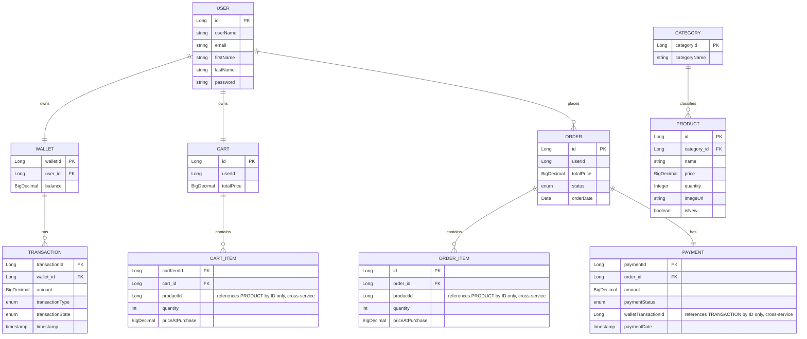

# Postman Testing Guide — E-Commerce Microservices (Final)

Covers: **wallet-service** (`localhost:8080`), **inventory-service** (`localhost:8082`), **shop-service** (`localhost:8081`).

## Before you start
- All 3 services + Eureka (`localhost:8761`) should show all three registered.
- Every protected endpoint needs `Authorization: Bearer <token>`. Get it from step 1.2, save it as a Postman collection variable (`{{token}}`).
- Test roughly in this order — later steps depend on IDs from earlier ones.
- ⚠️ = a known issue, not something you're doing wrong — see the "Known Gaps" section at the end.

---

## 1. Wallet-service — Auth & User

### 1.1 Signup
**POST** `http://localhost:8080/wallet/auth/signup`
```json
{
  "userName": "testuser1",
  "password": "Password123!",
  "firstName": "Test",
  "lastName": "User",
  "email": "testuser1@example.com"
}
```
Expected: 200/201, success message, no password echoed.

### 1.2 Login
**POST** `http://localhost:8080/wallet/auth/login`
```json
{ "userName": "testuser1", "password": "Password123!" }
```
Expected: 200, `{ "token": "..." }`. **Save this token.**

### 1.3 Get current user
**GET** `http://localhost:8080/wallet/users/mine` — Auth required.
Expected: 200, user data, no password field.

### 1.4 Update current user
**PATCH** `http://localhost:8080/wallet/users/mine` — Auth required.
```json
{ "firstName": "Updated", "email": "updated@example.com" }
```
Expected: 200, updated fields only. Try sending `"walletId": 999` too — should be rejected (400); confirms the wallet-hijack fix holds.

### 1.5 Delete current user
**DELETE** `http://localhost:8080/wallet/users/mine` — Auth required.
Expected: 204 only if wallet balance is 0 and no transactions exist, otherwise 400. Test on a **throwaway signup**, not your main test account — you'll need that account alive for the rest of this guide.

---

## 2. Wallet-service — Wallet operations

### 2.1 Deposit
**POST** `http://localhost:8080/wallet/deposit/mine?amount=500` — Auth required, no body.
Expected: 200, Transaction (DEPOSIT, COMPLETED).

### 2.2 Withdraw
**POST** `http://localhost:8080/wallet/withdraw/mine?amount=100` — Auth required, no body.
Expected: 200. Try `amount=999999` too → expect 400 insufficient balance.

### 2.3 Transfer
**POST** `http://localhost:8080/wallet/transfer?toUserId=2&amount=50` — Auth required, no body.
Note: needs a real second user — sign up a second test account first.
Expected: 200, two Transaction rows (PAYMENT, one per wallet).

### 2.4 Transaction history
**GET** `http://localhost:8080/wallet/transactions/mine` — Auth required.
Expected: 200, your transactions, newest first.

---

## 3. Inventory-service — Category

### 3.1 Create category
**POST** `http://localhost:8082/categories` — Auth required.
```json
{ "categoryName": "MEN" }
```
Expected: 201, `{ "categoryId": <id>, "categoryName": "MEN" }`. **Save categoryId.**

### 3.2 Get category by ID
**GET** `http://localhost:8082/categories/{categoryId}` — Auth required.

### 3.3 Get all categories
**GET** `http://localhost:8082/categories/all` — Auth required.

### 3.4 Update category
**PATCH** `http://localhost:8082/categories/{categoryId}` — Auth required.
```json
{ "categoryName": "MEN_UPDATED" }
```

### 3.5 Delete category
**DELETE** `http://localhost:8082/categories/{categoryId}` — Auth required.
Expected: 204. Use a spare category for this test, not the one your Products reference (⚠️ deleting a referenced category isn't guarded — see Known Gaps).

---

## 4. Inventory-service — Product

### 4.1 Create product
**POST** `http://localhost:8082/products` — Auth required.
```json
{
  "name": "Running Shoes",
  "price": 79.99,
  "quantity": 50,
  "imageUrl": "https://example.com/shoe.jpg",
  "isNew": true,
  "categoryId": 1
}
```
Expected: 201, includes `categoryId`. **Save productId.**

### 4.2 Get product by ID
**GET** `http://localhost:8082/products/{productId}` — Auth required.

### 4.3 Get products by category ⚠️
**GET** `http://localhost:8082/products/category/{category}` — Auth required.
Likely broken — the path variable is typed as the `Category` entity, never updated when Category moved from enum to entity. Expect this to fail; flag it, don't spend meeting time debugging live.

### 4.4 Update product (partial)
**PATCH** `http://localhost:8082/products/{productId}` — Auth required.
```json
{ "price": 69.99 }
```
Expected: 200, only price changes.

### 4.5 Purchase product
**POST** `http://localhost:8082/products/{productId}/purchase/5` — Auth required, no body.
Expected: 200, quantity decremented by 5.

### 4.6 Restock product
**POST** `http://localhost:8082/products/{productId}/restock/5` — Auth required, no body.
Expected: 200, quantity incremented by 5.

### 4.7 Delete product
**DELETE** `http://localhost:8082/products/{productId}` — Auth required.
Expected: 204. Use a spare product — not one you'll add to cart below.

---

## 5. Shop-service — Cart

### 5.1 Add item to cart
**POST** `http://localhost:8081/api/carts/mine/items` — Auth required.
```json
{ "productId": 1, "quantity": 2 }
```
Expected: 200/201, cart with item + `priceAtPurchase` captured from Inventory, correct `totalPrice`. Also try a nonexistent `productId` → expect 404, not silently accepted.

### 5.2 Get cart
**GET** `http://localhost:8081/api/carts/mine` — Auth required.
Expected: 200, current items + total.

### 5.3 Update item quantity
**PUT** `http://localhost:8081/api/carts/mine/items/{cartItemId}` — Auth required.
```json
{ "quantity": 4 }
```
Expected: 200, quantity + total updated. (Uses `cartItemId`, not `productId` — check the GET response for the right ID.)

### 5.4 Remove item from cart
**DELETE** `http://localhost:8081/api/carts/mine/items/{cartItemId}` — Auth required.
Expected: 200/204, item actually gone on the next GET (not just missing from this response).

### 5.5 Clear cart
**DELETE** `http://localhost:8081/api/carts/mine` — Auth required.
Expected: 200/204, cart emptied.

---

## 6. Shop-service — Checkout & Order

Checkout now reads directly from your persisted Cart — there's no separate "place order with a body" endpoint anymore. Add items to cart (section 5) before running this.

### 6.1 Checkout (place order from cart)
**POST** `http://localhost:8081/api/carts/mine/checkout` — Auth required, no body.
Expected: 201, order with status `PROCESSING` (happy path — stock reserved, wallet deducted). Confirm your cart is now empty (`GET /api/carts/mine`) and the product's stock actually decreased (`GET /products/{id}` on inventory-service).
Also test: add an item costing more than your wallet balance, checkout again → expect the order created with `PAYMENT_FAILED`, and stock correctly restored (compare product quantity before/after).

### 6.2 Get order by ID ⚠️
**GET** `http://localhost:8081/api/orders/{orderId}` — Auth required.
Works, but has no ownership check — any authenticated user can fetch any order by guessing an ID. Known gap, not a test failure.

### 6.3 Get my orders
**GET** `http://localhost:8081/api/orders/mine` — Auth required.
Expected: 200, only your own orders.

### 6.4 Cancel order
**PATCH** `http://localhost:8081/api/orders/{orderId}/cancel` — Auth required, no body.
Expected: 200, status `CANCELLED`, stock restocked, only works on `PENDING`/`PROCESSING` orders (an already-`PROCESSING` order from 6.1 should cancel fine; try it again on the same order afterward → expect 400, already cancelled).

---

## Known Gaps — flag these, don't debug live

1. **`GET /products/category/{category}`** likely fails — path variable type wasn't updated when Category moved from enum to entity.
2. **`GET /api/orders/{id}`** has no ownership check — inconsistent with every other endpoint's `/mine` pattern.
3. **No FK guard** on deleting a Category still referenced by a Product, or a Product still referenced by an Order/Cart item — could throw a raw 500 instead of a clean 4xx.
4. **Cancel's restock-on-failure** is only logged server-side (`System.err`), not retried or surfaced to the client if it fails.
5. **Transaction and Payment intentionally have no update/delete** endpoints — they're financial audit records; this was a deliberate exception to the "all entities need CRUD" instruction, not an oversight.

---

## ERD



Note: `PRODUCT`, `CART_ITEM`/`ORDER_ITEM`, and `TRANSACTION`/`PAYMENT` links across the dashed service boundary (Inventory ↔ Shop ↔ Wallet) are **not real foreign keys** — each service has its own database, so these are ID references resolved at runtime via Feign calls, not DB-enforced relationships. That's also why gap #3 above (no FK guard) exists — there's no database constraint to catch it.